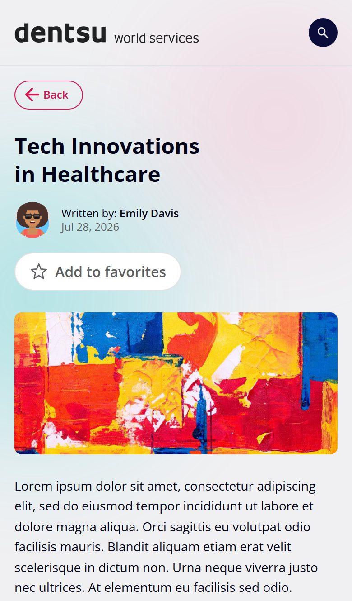
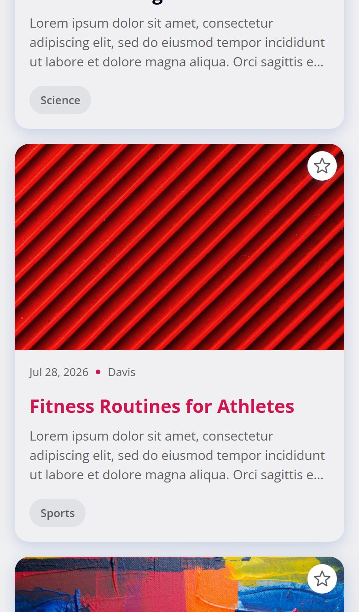
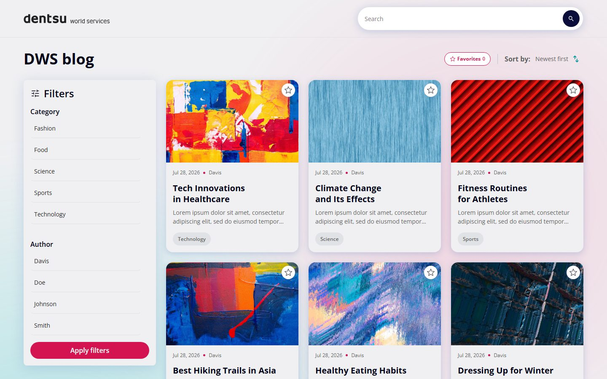
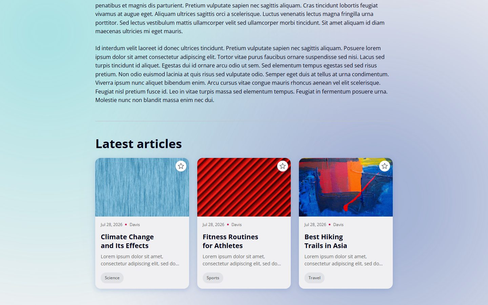

# DWS Blog

A blog front end built for the DWS technical test: a post listing with search, filtering and
sorting, a post detail page, and favorites that survive a reload.

**Live:** https://dws-blog-omega.vercel.app

## Screens

### Mobile

| Listing                                                                                                 | Post detail                                                                                                 | Latest articles                                                                                                  |
| ------------------------------------------------------------------------------------------------------- | ----------------------------------------------------------------------------------------------------------- | ---------------------------------------------------------------------------------------------------------------- |
|  |  |  |

### Desktop

| Listing                                                                                                      | Post detail                                                                                                     | Latest articles                                                                                                     |
| ------------------------------------------------------------------------------------------------------------ | --------------------------------------------------------------------------------------------------------------- | ------------------------------------------------------------------------------------------------------------------- |
|  |  |  |

## Stack

| Concern           | Choice                                           |
| ----------------- | ------------------------------------------------ |
| Framework         | React 19 + TypeScript, built with Vite           |
| Routing           | React Router 7 (`createBrowserRouter`)           |
| Global state      | Redux Toolkit + React Redux                      |
| Styling           | SCSS modules over a token layer, no UI framework |
| Testing           | Vitest + Testing Library (jsdom)                 |
| Component catalog | Storybook 10                                     |

## Getting started

Requires Node 20.19+ (or 22.12+) and npm.

```bash
npm install
cp .env.example .env
npm start
```

The app runs at http://localhost:5173.

### Environment

| Variable            | Default                                  | Purpose                    |
| ------------------- | ---------------------------------------- | -------------------------- |
| `VITE_API_BASE_URL` | `https://tech-test-backend.dwsbrazil.io` | Base URL for the posts API |

The default is baked into the API client, so the app also runs without a `.env`.

## Scripts

| Script                    | What it does                                         |
| ------------------------- | ---------------------------------------------------- |
| `npm run dev`             | Vite dev server with HMR                             |
| `npm run build`           | Type-checks the project, then builds to `dist/`      |
| `npm run preview`         | Serves the production build locally                  |
| `npm test`                | Runs the test suite once                             |
| `npm run test:watch`      | Reruns tests on change                               |
| `npm run test:coverage`   | Runs the suite with a coverage report and thresholds |
| `npm run storybook`       | Component catalog at http://localhost:6006           |
| `npm run build-storybook` | Static catalog in `storybook-static/`                |
| `npm run lint`            | ESLint over the whole project                        |
| `npm run format`          | Prettier write; `format:check` to verify only        |

## Testing

433 tests across 54 files, covering the utilities, the API layer, the store, every hook, every
component and both pages.

| Metric     | Coverage |
| ---------- | -------- |
| Statements | 99.4%    |
| Branches   | 97.61%   |
| Functions  | 100%     |
| Lines      | 100%     |

`npm run test:coverage` enforces 95% statements, lines and functions, and 90% branches.

Tests sit next to the code they cover (`src/utils/date.ts` → `src/utils/date.test.ts`). Shared
helpers live in `src/test/`:

- `factories.ts` — builders for the domain and API shapes, with fixed dates so formatting and
  sorting assertions stay deterministic. Stories reuse these too.
- `renderWithProviders.tsx` — renders inside a fresh store and a memory router, and accepts
  `preloadedState`, `initialEntries` and a route `path` for components that read route params.
- `mockFetch.ts` — `fetch` stubs for the API layer. There is no mock server; nothing in the suite
  touches the network.

Assertions go through roles and accessible names rather than CSS module classes, which resolve to
`undefined` under Vitest.

## Storybook

`npm run storybook` opens a catalog of 75 stories across 21 files. Global decorators supply a
per-story Redux store and a memory router, so store-connected components work without per-story
setup; `parameters.preloadedState` and `parameters.route` seed either one. The `a11y` addon runs
axe against every story.

The canvas defaults to the real page background (`--color-neutral-lightest`), with white and the
brand blue available from the toolbar.

## Project structure

```
src/
├── api/          Fetch client, endpoints and API→domain mappers
├── components/
│   ├── features/ Composed, domain-aware components (search, filters, article)
│   ├── icons/    SVG components
│   ├── layout/   Root layout, header, background decoration
│   └── ui/       Presentational building blocks
├── constants/    Closed option sets (sort order, variants)
├── hooks/        Data fetching, filtering, search and DOM measurement
├── pages/        Route components
├── store/        Redux slices, selectors and the store factory
├── styles/       Tokens, reset, typography, mixins
├── test/         Test-only helpers
├── types/        API and domain types
└── utils/        Pure functions
```

## Architecture decisions

**Filter options are derived from the posts, not from their own endpoints.** `/posts` already
embeds the author and the categories, so the category and author filters are extracted from the
loaded listing. That saves two requests and guarantees a filter never offers a value that would
return nothing. `/authors` and `/categories` remain implemented in the API layer.

**Search matches in memory.** The API has no query parameter, so the listing is fetched once on the
first query and every later keystroke is matched locally against the title, the author name and the
category names. A 300 ms debounce sits between the typed term and the matched one — with the data
already in memory, what it saves is a re-filter per keystroke rather than a request. Accents are
folded when matching but not when highlighting, where folding would shift the segment offsets away
from the original text.

**The URL owns what is worth sharing.** The search term lives in `?q=` and a category chip commits
`?category=<name>`. Both are read by `usePostFilters` as seeds, not bindings: once the listing is
open the filter bar and sidebar own the selection, and nothing rewrites the URL behind the reader.

**Favorites are global, filters are not.** Favorites are written from the listing and from the
detail route, read from both plus the filter layer, and they outlive the page — that is what the
store is for. Category, author and sort selections are consumed by one page and two of its direct
children, so they stay local in `usePostFilters`.

**Persistence sits beside the reducer, not inside it.** Favorites and recent searches survive a
reload through `localStorage`: hydration goes through `preloadedState`, writes go through a listener
middleware. The reducers stay pure and storage access stays out of the render path. Reads and writes
are wrapped in `try/catch`, so private browsing or a full quota degrades to a session-only list
rather than breaking the listing.

**The desktop sidebar stages its selections, but clearing never does.** The sidebar carries an
"Apply filters" button, so its selections are held in a local draft and committed on press. Clearing
has nothing to assemble, so it drops the draft and commits an empty selection in one click.

**A missing post is an answer, not a failure.** `getPostById` turns a 404 into `null` and lets every
other status throw. The detail page can then separate the two: an absent post gets "Post not found",
while a network or server failure gets the error state and a retry button. Offering to retry a 404
would be promising something that cannot work.

**Complementary sections hide themselves.** "Latest articles" reuses `/posts`, drops the post being
read and takes the three most recent; a failed or empty listing hides the section entirely rather
than stacking an error on top of an article that loaded fine. The category chips in the search panel
behave the same way.

Design-level rationale — token conflicts between the design system and the mockups, spacing and
ratio choices — is kept separately in `NOTES.md`.

## Known limitations

- **Sorting has no visible effect against the real API.** Every post comes back with an identical
  `createdAt`, so newest and oldest produce the same order. The control was built because it is a
  requirement, with no invented secondary ordering as a fallback. `sortPosts` is tested against
  synthetic dates.
